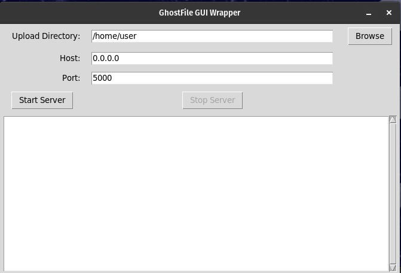
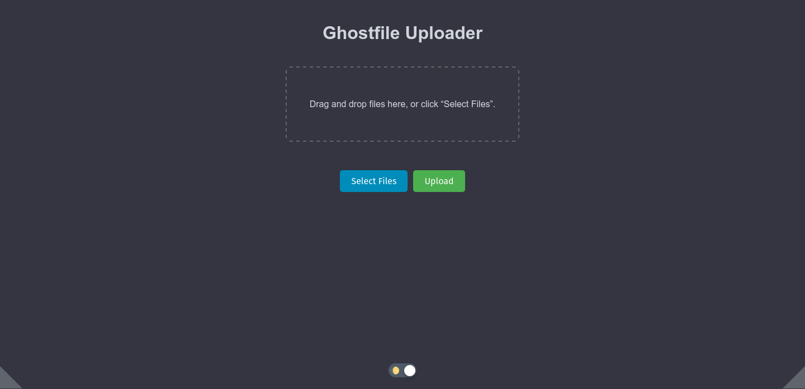

# GhostFile: Ephemeral File Upload Server

GhostFile is a lightweight, one-time file upload server that automatically shuts down after handling an upload. It’s designed for quick, ephemeral file transfers and is distributed as a single, self-contained binary. GhostFile can run in either command-line (CLI) mode or with a graphical user interface (GUI).

## 💡 Important Notes:

-   **Preferred Usage:** Running the binary is the recommended way to use GhostFile because it is self-contained and requires no additional dependencies.
    
-   **Dual-Mode Operation:**
    
    -   **CLI Mode:** When launched from a terminal, GhostFile runs in CLI mode with all command-line options available.
        
    -   **GUI Mode:** When launched from a desktop environment (or forced with `--gui true`), a GUI appears with configuration fields and a live log window.
        
    -   You may override the auto-detection with the flag: `--gui true` or `--gui false`.
        
-   **Asset Inclusion:** The web interface requires the accompanying `index.html` file, which is bundled with the binary.
    
-   **Platform Compatibility:** Although GhostFile is likely compatible with Windows and macOS, it has only been tested on Linux.
    
-   **ARM64 Testing:** Binaries for both Intel (x86_64) and ARM64 have been built. ARM64 testing is limited – please report any issues.
    

----------

## 📂 Download and Installation

### Binary Distribution (Recommended)

Download the pre-built binaries from our [dist folder](https://github.com/jon6fingrs/ghostfile/tree/main/dist).

#### For Intel (x86_64):

Download the Intel binary with `wget`:

```
wget -O ghostfile https://raw.githubusercontent.com/jon6fingrs/ghostfile/main/dist/ghostfile
chmod +x ghostfile
```

#### For ARM64:

Download the ARM64 binary and automatically rename it to `ghostfile`:

```
wget -O ghostfile https://raw.githubusercontent.com/jon6fingrs/ghostfile/main/dist/ghostfile-arm64
chmod +x ghostfile
```

### Moving the Binary to Your PATH

After downloading, move the binary to a directory in your PATH so you can run it from anywhere:

#### Ubuntu/Debian:

```
sudo mv ghostfile /usr/local/bin/
```

#### Fedora:

```
sudo mv ghostfile /usr/bin/
```

#### Arch Linux:

```
sudo mv ghostfile /usr/local/bin/
```

Now, you can launch GhostFile from any terminal by typing `ghostfile` (for Intel) or `ghostboard` (for ARM64).

----------

## 🔌 How to Use GhostFile

### Running the Binary

#### From the Terminal (CLI Mode)

When you run the binary from a terminal, it automatically detects the environment and defaults to CLI mode unless overridden:

```
ghostfile
```

**Default CLI Behavior:**

-   **Upload Directory:**
    
    -   If the binary is run from the same directory where it resides, it defaults to a subdirectory called `./downloads` (created automatically if needed).
        
    -   If run from another location, it defaults to the current working directory.
        
-   **Host:**  `0.0.0.0` (all network interfaces)
    
-   **Port:**  `5000`
    

**Overriding Mode:**

Use `--gui false` to force CLI mode or specify other options:

```
ghostfile --dir /path/to/upload --host 127.0.0.1 --port 8080 --gui false
```

Pressing `Ctrl+C` in CLI mode will gracefully shut down the server.

#### From a Desktop Environment (GUI Mode)

If you launch the binary by double-clicking it or from a desktop launcher, no terminal is attached and GhostFile automatically starts in GUI mode (unless overridden with `--gui false`).

In GUI mode, a window opens that allows you to:

-   Specify the upload directory (defaulting to your home directory; the directory selector will start from the current text field value or fall back to the home directory if invalid).
    
-   Set the host (default: `0.0.0.0`) and port (default: `5000`).
    
-   Start and stop the server.
    
-   View live logging output.
    

To force GUI mode from the command line:

```
ghostfile --gui true
```

### Using the Python Script Directly

If you prefer not to use the binary, you can run the Python script directly:

```
python3 ghostfile-gui.py [options]
```

This supports the same command-line options as described above.

### Docker Option

Docker is also supported. Note that Docker does **not** support GUI mode (only CLI mode is available).

For example:

```
docker run --rm -it -v "$(pwd)":/src thehelpfulidiot/ghostfile [options]
```

Replace `[options]` with your desired command-line switches. The container logs will be output to Docker’s stdout.

----------

## 🏘️ Build Instructions

GhostFile is built using PyInstaller to create a single self-contained binary.

#### For Intel (x86_64):

```
pyinstaller --onefile --windowed \
  --add-binary "/usr/lib/x86_64-linux-gnu/libpython3.8.so:." \
  --add-data "index.html:." \
  ghostfile-gui.py
```

#### For ARM64:

```
pyinstaller --onefile --windowed \
  --add-binary "/usr/local/lib/libpython3.8.so.1.0:." \
  --add-data "index.html:." \
  ghostfile-gui.py
```

_Note:_ Adjust the shared library paths as needed. For maximum compatibility, build using Python 3.8 on an older distribution (e.g., Ubuntu 18.04 or CentOS 7).

----------

## 🔎 Default Behavior Summary

### CLI Mode:

-   **Upload Directory:**
    
    -   If run from the binary’s directory: defaults to `./downloads`.
        
    -   Otherwise: defaults to the current working directory.
        
-   **Host:**  `0.0.0.0`
    
-   **Port:**  `5000`
    
-   **Mode Override:**  `--gui false` forces CLI mode.
    

### GUI Mode:

-   **Upload Directory:** Defaults to the user’s home directory.
    
-   **Directory Selector:** Uses the current text field value as the starting point if valid.
    
-   **Host:**  `0.0.0.0`
    
-   **Port:**  `5000`
    
-   **Mode Override:**  `--gui true` forces GUI mode.
    
----------

## 📸 Screenshots

### GUI Mode


### Web UI


----------


Enjoy using **GhostFile**! For feedback or contributions, please open an issue or submit a pull request.
