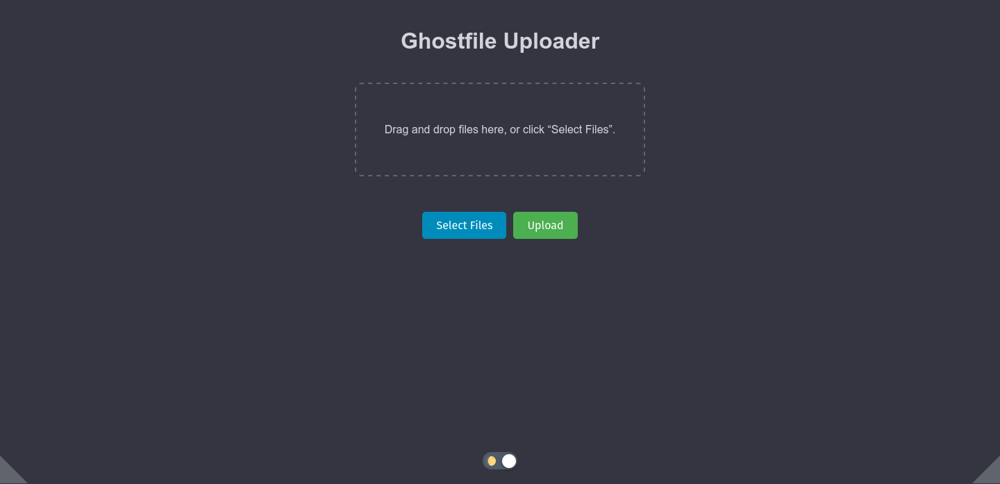

# GhostFile: Ephemeral File Upload Server

GhostFile is a tiny one-shot upload server. Run it, open the page from another
device, drop in one or more files, and GhostFile saves them and exits.

It's a single static binary (~6 MB, no dependencies) with the web page built in.



## Install

### Binary

Grab a build from the [latest release](https://github.com/jon6fingrs/ghostfile/releases/latest):

```sh
# Linux x86_64 (use ghostfile-linux-arm64 for ARM)
curl -Lo ghostfile https://github.com/jon6fingrs/ghostfile/releases/latest/download/ghostfile-linux-amd64
chmod +x ghostfile
sudo mv ghostfile /usr/local/bin/
```

macOS (`ghostfile-darwin-arm64` / `-amd64`) and Windows (`ghostfile-windows-amd64.exe`)
builds are on the same page.

### Debian / Ubuntu

```sh
curl -LO https://github.com/jon6fingrs/ghostfile/releases/latest/download/ghostfile_amd64.deb
sudo apt install ./ghostfile_amd64.deb
```

This installs `/usr/bin/ghostfile`, `/usr/bin/ghostfile-send` and a desktop launcher. It upgrades the old
2.x package in place.

### Nix / NixOS

Try it without installing:

```sh
nix run github:jon6fingrs/ghostfile -- --dir ~/Downloads
```

Declaratively, in your system flake:

```nix
{
  inputs.ghostfile.url = "github:jon6fingrs/ghostfile";
  inputs.ghostfile.inputs.nixpkgs.follows = "nixpkgs";

  outputs = { nixpkgs, ghostfile, ... }: {
    nixosConfigurations.myhost = nixpkgs.lib.nixosSystem {
      modules = [
        ghostfile.nixosModules.default
        {
          programs.ghostfile.enable = true;
          programs.ghostfile.openFirewall = true; # opens TCP 5000
        }
      ];
    };
  };
}
```

Without flakes, import the module directly in `configuration.nix`:

```nix
{
  imports = [
    "${builtins.fetchTarball "https://github.com/jon6fingrs/ghostfile/archive/main.tar.gz"}/module.nix"
  ];

  programs.ghostfile.enable = true;
  programs.ghostfile.openFirewall = true; # opens TCP 5000
}
```

To pin a version, use a tag URL (e.g. `.../archive/v3.0.0.tar.gz`) and add
`sha256` from `nix-prefetch-url --unpack <url>`.

The flake also exports `packages.<system>.default` (for `environment.systemPackages`
or home-manager's `home.packages`) and `overlays.default`, which adds `pkgs.ghostfile`.

### Docker

```sh
docker build -t ghostfile .
docker run --rm -it -p 5000:5000 -v "$(pwd)":/src ghostfile
```

Uploads land in the mounted directory.

## Usage

### Receiving

```
ghostfile [--dir DIR] [--host HOST] [--port PORT] [--keep]
```

| Flag        | Default   | Description                                         |
|-------------|-----------|-----------------------------------------------------|
| `--dir`     | `.`       | Where to save uploads (created if missing)          |
| `--host`    | `0.0.0.0` | Address to bind to                                  |
| `--port`    | `5000`    | Port to listen on                                   |
| `--keep`    | off       | Keep running after an upload instead of exiting     |
| `--version` |           | Print the version                                   |

On startup it prints the LAN URLs to open. After a successful upload it prints
each saved path and exits with status 0, so it composes in scripts:

```sh
ghostfile --dir /tmp/incoming && ls /tmp/incoming
```

### Sending from the command line

From another machine with ghostfile installed:

```sh
ghostfile-send 192.168.1.20 report.pdf            # port defaults to 5000
ghostfile-send 192.168.1.20:8080 photos/ notes.txt
```

`ghostfile-send` is the same binary under another name. `ghostfile send ...` does
the same thing, which is the form to use on Windows. All files go in a single
upload, so the receiver saves them and exits as usual, or stays up with `--keep`.
Directories are sent recursively and keep their structure, so `photos/` arrives
as `DIR/photos/...`.

No ghostfile on the sending machine? Use `curl`:

```sh
curl -F files=@report.pdf -F files=@notes.txt http://192.168.1.20:5000/upload
```

### Notes

- Existing files are never overwritten. A duplicate name is saved as `name (1).ext`.
- Submitting the form with no files doesn't stop the server.
- `Ctrl+C` stops it cleanly.
- There is no authentication. It's meant for trusted networks.

## Build from source

```sh
go build -o ghostfile .        # or: nix build
```

Releases are built by GitHub Actions when a `v*` tag is pushed
(`git tag v3.1.0 && git push origin v3.1.0`). The workflow cross-compiles every
platform, builds the `.deb`s, and attaches them all to the release.

## Changes in 3.0

GhostFile was rewritten from Python/Flask/Tk to Go.

- The Tk GUI window and `--gui` flag are gone. `--gui` is still accepted and
  ignored, so old scripts don't break. The desktop launcher now opens in a terminal.
- With no `--dir`, uploads go to the current directory. Version 2 used `./downloads`
  when run from the binary's own directory.
